```mermaid
flowchart TD
    Start([User sends message with PII]) --> CheckFiles{Files selected?}
    
    CheckFiles -->|Yes| ExtractMessage[Extract user message content]
    CheckFiles -->|No| CheckPII[Check if PII masking enabled]
    
    ExtractMessage --> RAGUnmasked[Send UNMASKED query to RAG<br/>PII visible for accurate search]
    RAGUnmasked --> RAGSearch[RAG similarity search<br/>Finds relevant document chunks]
    RAGSearch --> MaskMessage[Mask PII in user message<br/>Replace with placeholders]
    MaskMessage --> MaskRAGContext{CRITICAL SECURITY:<br/>PII masking<br/>enabled?}
    
    MaskRAGContext -->|Yes| MaskChunks[Mask PII in RAG context chunks<br/>Replace all PII with placeholders<br/>NO PII sent to external LLM]
    MaskRAGContext -->|No| KeepChunksUnmasked[Keep RAG chunks unmasked]
    
    MaskChunks --> CheckMasked{Message contains<br/>masked PII?}
    KeepChunksUnmasked --> CheckMasked
    
    CheckMasked -->|Yes| AddMaskedContext[Add enhanced context instruction<br/>Explain placeholders represent real values]
    CheckMasked -->|No| AddNormalContext[Add standard context instruction]
    
    AddMaskedContext --> InjectContext[Inject MASKED RAG context<br/>All PII replaced with placeholders]
    AddNormalContext --> InjectContext
    
    InjectContext --> CheckPII
    
    CheckPII -->|PII enabled| CreateMiddleware[Create PII Guardrail Middleware]
    CheckPII -->|No PII| NoMiddleware[No middleware]
    
    CreateMiddleware --> BuildSystemPrompt{Has PII<br/>masking?}
    NoMiddleware --> BuildSystemPrompt
    
    BuildSystemPrompt -->|Yes| EnhancedPrompt[Enhanced system prompt<br/>Instruct AI to match placeholders]
    BuildSystemPrompt -->|No| StandardPrompt[Standard system prompt]
    
    EnhancedPrompt --> SendToAI[Send to AI:<br/>- Masked user message<br/>- Masked RAG context<br/>- Enhanced prompts<br/>ZERO PII exposed to LLM]
    StandardPrompt --> SendToAI
    
    SendToAI --> MiddlewareCheck{Message already<br/>masked?}
    
    MiddlewareCheck -->|Yes, has placeholders| SkipMasking[Middleware skips masking<br/>Idempotency check]
    MiddlewareCheck -->|No placeholders| ProcessMasking[Middleware masks<br/>other messages if needed]
    
    SkipMasking --> AIProcess[AI processes request]
    ProcessMasking --> AIProcess
    
    AIProcess --> MatchPlaceholders[AI matches placeholders<br/>in both query and context<br/>Uses semantic understanding]
    MatchPlaceholders --> GenerateResponse[Generate response<br/>Based on masked context + intent<br/>No actual PII processed]
    GenerateResponse --> ReturnResponse([Return response to user])
    
    style RAGUnmasked fill:#90EE90
    style MaskMessage fill:#FFB6C1
    style MaskChunks fill:#FF6B6B
    style SendToAI fill:#87CEEB
    style MatchPlaceholders fill:#FFD700
```

## Flow Steps

1. **User Input**: User sends message containing PII (phone numbers, emails, names)

2. **RAG Search** (if files selected):
   - Extract user message
   - Send **UNMASKED** query to RAG
   - RAG performs similarity search with actual PII values
   - Finds relevant document chunks
   - **⚠️ RAG operates on PII, but this is internal (not sent externally)**

3. **Masking User Message**:
   - After RAG search, mask PII in user message
   - Replace with placeholders: `<NUMBER>`, `<EMAIL>`, `<RUSSIAN_NAME>`
   - Update message in `modelMessages`

4. **🔒 CRITICAL SECURITY: Mask RAG Context Chunks**:
   - **Mask ALL PII in RAG context chunks before sending to AI**
   - Each chunk's content is processed through PII Detection Engine
   - Replace PII with same placeholders used in user message
   - **This ensures ZERO PII is sent to external LLM (OpenAI, Google, etc.)**
   - This is the most critical security step identified by security review

5. **Context Preparation**:
   - Inject **MASKED** RAG context (all PII replaced with placeholders)
   - Add enhanced instruction if masked PII detected
   - Explain that placeholders represent real values used for retrieval
   - AI will match placeholders semantically without seeing actual values

6. **AI Configuration**:
   - Create PII middleware if enabled
   - Build enhanced system prompt when PII masking is active
   - Instruct AI to match placeholders with corresponding placeholders in context

7. **Middleware Processing**:
   - Check if message already masked (idempotency)
   - Skip if already masked, process if not

8. **AI Processing**:
   - Receive masked user message
   - Receive masked RAG context (all PII replaced)
   - Match placeholders semantically (e.g., `<NUMBER>` in query matches `<NUMBER>` in context)
   - Generate response based on semantic understanding without processing actual PII

9. **Response**:
   - User receives accurate answer
   - No PII was exposed to external LLM
   - Answer quality maintained through semantic matching

## Security Architecture

### Defense in Depth

**Layer 1: RAG Layer (Internal)**
- PII is used for accurate document retrieval
- This happens **internally** on your infrastructure
- RAG database contains PII, but it's your controlled environment

**Layer 2: Masking Layer (Before External Transmission)**
- User message masked after RAG search ✅
- **RAG context chunks masked before AI** ✅ **(CRITICAL)**
- All PII replaced with consistent placeholders

**Layer 3: AI Layer (External)**
- Only masked placeholders sent to LLM
- Zero actual PII values transmitted
- AI uses semantic understanding to answer

### Key Security Principles

- ✅ **PII sent to RAG**: For accurate document retrieval (internal operation)
- ✅ **PII NOT sent to AI**: Both user message AND context chunks are masked
- ✅ **Semantic understanding preserved**: AI can still answer accurately by matching placeholders
- ✅ **Idempotency**: Middleware skips already-masked messages
- ✅ **Zero-trust external transmission**: Assume external LLMs cannot be trusted with PII

### Risk Mitigation

This implementation follows the **preferred security path** recommended by security review:

**Maximum Security Approach:**
- ✅ Mask PII in user query
- ✅ Mask PII in RAG context chunks **(IMPLEMENTED)**
- ✅ Use semantic matching for answer generation
- ✅ Guarantee no PII leaves your perimeter

**Trade-offs:**
- ✅ **Security**: 100% guarantee no PII sent to external LLM
- ⚠️ **Quality**: May slightly reduce answer accuracy if context matching is imperfect
- ✅ **Acceptable**: The security benefit far outweighs minimal quality impact
