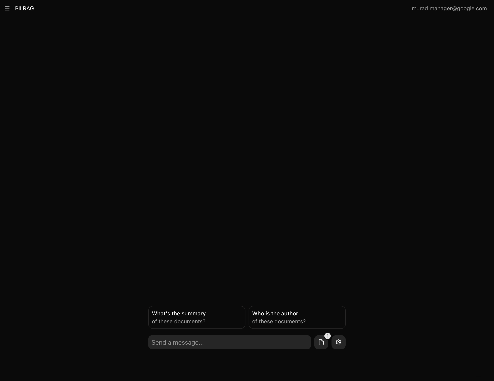

<a href="https://pii-rag.vercel.app">
  
  <h1 align="center">PII RAG</h1>
</a>

<p align="center">
  Retrieval-Augmented Generation with PII Guardrails.
</p>

<div align="center">

> **⚠️ WARNING: This project is currently in early development**  
> **Features and APIs may change. Use at your own risk.**

</div>

<p align="center">
  <a href="#features"><strong>Features</strong></a> ·
  <a href="#model-providers"><strong>Model providers</strong></a> ·
  <a href="#deploy-your-own"><strong>Deploy your own</strong></a> ·
  <a href="#running-locally"><strong>Running locally</strong></a>
</p>
<br/>

## ## Features

- [Next.js 16](https://nextjs.org) App Router
  - Advanced routing for seamless navigation and performance
  - React Server Components (RSCs) for server-side rendering and performance improvements
- [AI SDK v5](https://sdk.vercel.ai/docs)
  - Unified API for generating text, structured objects, and tool calls with LLMs
  - Hooks for building dynamic chat and generative user interfaces
- [Drizzle ORM](https://orm.drizzle.team)
  - Type-safe SQL ORM with TypeScript support
  - Database migrations and schema management
- [Shadcn/UI](https://ui.shadcn.com)
  - Styling with [Tailwind CSS](https://tailwindcss.com)
  - Component primitives from [Radix UI](https://radix-ui.com) for accessibility and flexibility

## Model providers

This app ships with [OpenAI](https://openai.com/) provider as the default. However, with the [AI SDK](https://sdk.vercel.ai/docs), you can switch LLM providers to [Anthropic](https://anthropic.com), [Ollama](https://ollama.com), [Cohere](https://cohere.com/), and [many more](https://sdk.vercel.ai/providers/ai-sdk-providers) with just a few lines of code.

## Deploy your own

You can deploy your own version of VibeStack to Vercel with one click:

[](https://vercel.com/new/clone?repository-url=https%3A%2F%2Fgithub.com%2Fmurad-pc%2Fpii-sdk&env=OPENAI_API_KEY,AUTH_SECRET,BLOB_READ_WRITE_TOKEN,POSTGRES_URL&envDescription=Required%20environment%20variables%20for%20PII%20RAG&envLink=https%3A%2F%2Fgithub.com%2Fmurad-pc%2Fpii-sdk%2Fblob%2Fmain%2F.env.example&demo-title=PII%20RAG&demo-description=A%20secure%20RAG%20system%20that%20processes%20PDF%20documents%20with%20PII%20masking%20capabilities&demo-url=https%3A%2F%2Fpii-rag.vercel.app)

## Running locally

You will need to use the environment variables [defined in `.env.example`](.env.example) to run VibeStack. It's recommended you use [Vercel Environment Variables](https://vercel.com/docs/projects/environment-variables) for this, but a `.env` file is all that is necessary.

> Note: You should not commit your `.env` file or it will expose secrets that will allow others to control access to your various AI provider accounts.

1. Install Vercel CLI: `npm i -g vercel`
2. Link local instance with Vercel and GitHub accounts (creates `.vercel` directory): `vercel link`
3. Download your environment variables: `vercel env pull`

```bash
bun install
bun dev
```

Your app should now be running on [localhost:3000](http://localhost:3000/).
